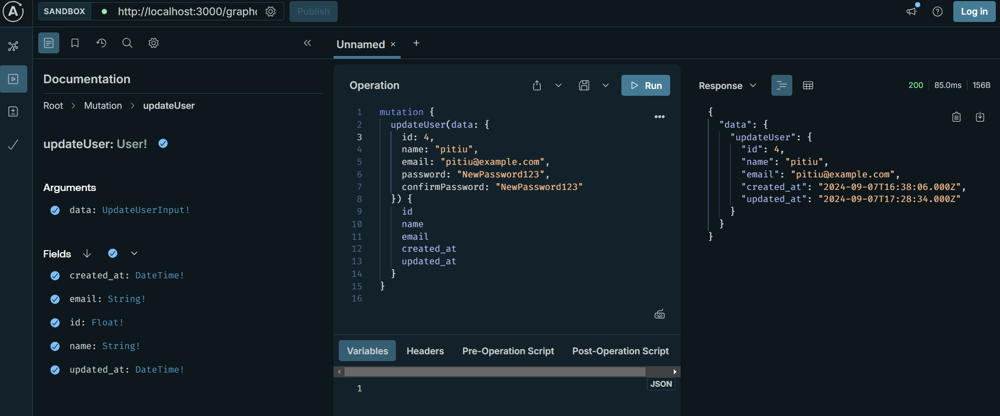
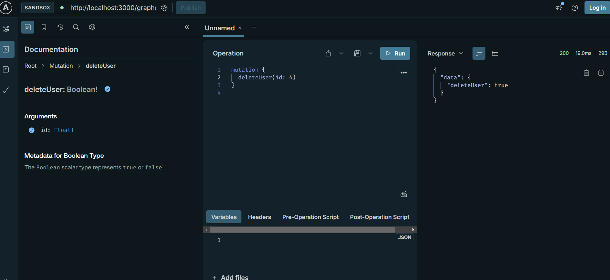

# Projeto de Aprendizado com NestJS e GraphQL

Este projeto foi desenvolvido com o intuito de aprender e praticar a construção de uma API usando NestJS e GraphQL. O foco do projeto foi implementar operações CRUD (Create, Read, Update, Delete) para gerenciar usuários, garantindo boas práticas de segurança e organização do código.

## Tecnologias Utilizadas

- **NestJS**: Um framework para construir aplicações Node.js escaláveis e eficientes.
- **GraphQL**: Uma linguagem de consulta para APIs que permite solicitar exatamente os dados necessários.
- **TypeORM**: Um ORM (Object-Relational Mapping) que facilita a interação com o banco de dados.
- **SQLite**: Um banco de dados relacional leve e auto-contido.
- **bcrypt**: Uma biblioteca para criptografar senhas de forma segura.
- **Apollo Studio**: Uma plataforma para gerenciar e monitorar APIs GraphQL.

## Funcionalidades Implementadas

### 1. Criação de Usuário

O endpoint para criação de usuário permite adicionar um novo usuário ao banco de dados. A senha é criptografada antes de ser armazenada para garantir a segurança dos dados.

**Exemplo de Mutação**:

### 2. Listagem de Usuários

O endpoint de listagem retorna todos os usuários cadastrados no banco de dados, mostrando informações como ID, nome, email, e datas de criação e atualização.

**Exemplo de query**:

### 3. Edição de Usuário

O endpoint de edição permite atualizar as informações de um usuário existente. Caso a senha seja alterada, ela é novamente criptografada antes de ser armazenada.

**Exemplo de Mutação**:

### 4. Deleção de Usuário

O endpoint de deleção permite remover um usuário do banco de dados com base no seu ID.

**Exemplo de Mutação**:

